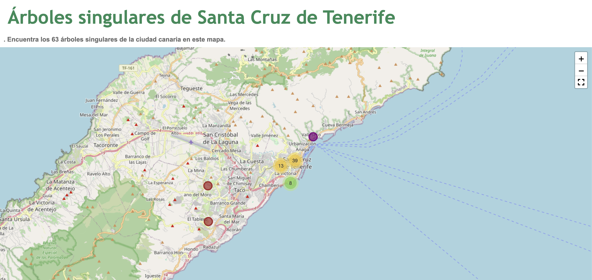

# Singular Trees of Santa Cruz de Tenerife 🌳

This project visualizes the unique botanical elements found in urban areas of **Santa Cruz de Tenerife**. It highlights trees of singular value, helping the community recognize the natural treasures within their city. By leveraging interactive maps, this project aims to **democratize natural resources** and raise awareness of the importance of these trees to the local environment.

## Visit the Final Project Website
Explore the project live at: [Arboles Singulares de Santa Cruz de Tenerife](https://pablo-ferro.github.io/ArbolesSingularesSantaCruzTenerife/)

## Features

- **Interactive Map**: Explore singular trees across Santa Cruz de Tenerife with an easy-to-use map interface.
- **Marker Clusters**: Clusters of markers simplify viewing in densely populated areas.
- **Family-Based Color Coding**: Trees are color-coded based on their botanical family (e.g., Fagaceae, Myrtaceae).
- **Fullscreen View**: Enjoy an immersive experience with the fullscreen option.
- **MiniMap**: Navigate easily with a minimap in the corner.
- **Measurement Tool**: Measure distances and areas directly on the map.
- **Drawing Tool**: Draw custom shapes on the map for planning or illustration purposes.

## Tech Stack

- **Folium**: For building the interactive map.
- **Leaflet.js**: Map rendering in the background via Folium.
- **Pandas**: For data manipulation and loading singular trees data.

## Data

The dataset used in this project includes information about singular trees in Santa Cruz de Tenerife, such as:
- **Geocode**: Unique identifier for each tree.
- **Common Name**: The local name of each tree.
- **Family**: Botanical family of each tree.
- **Coordinates**: Latitude and longitude for precise location.

## How It Works

1. The map is centered on Santa Cruz de Tenerife.
2. Trees are displayed as **circle markers**, color-coded based on their family.
3. You can interact with the map using several tools:
   - **Zoom controls**: Navigate through the map easily (scroll disabled).
   - **Fullscreen mode**: Enter fullscreen for a more immersive experience.
   - **MiniMap**: Toggleable mini map for easy navigation.
   - **Measure distances**: Use the measurement tool to gauge distances on the map.
   - **Draw shapes**: Add annotations or custom shapes directly onto the map.

## Future Enhancements

- Add more botanical families and enhance the color scheme.
- Implement search functionality to find specific trees by name or family.
- Add historical and environmental information for each singular tree.
- Improve the website to reach a level were users appreciate this information and use it to explore the city.

## Contributing

Contributions are welcome! Feel free to open issues or submit pull requests to improve this project.
